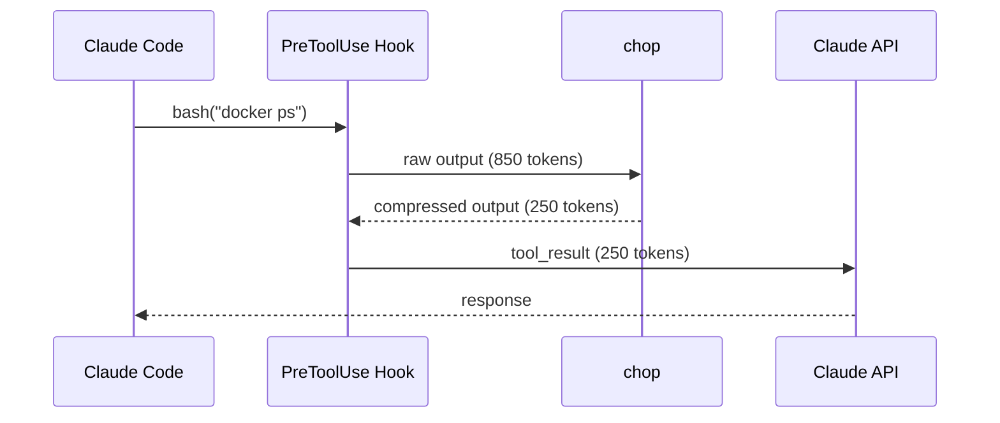
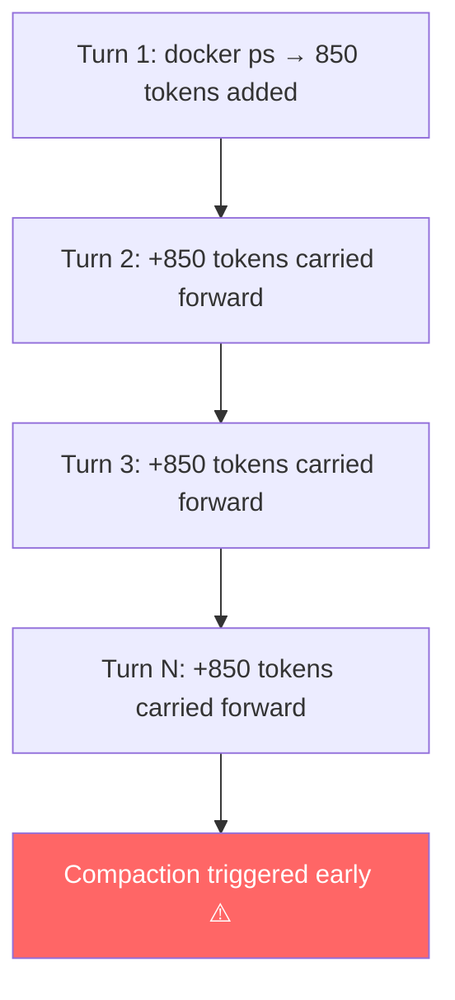
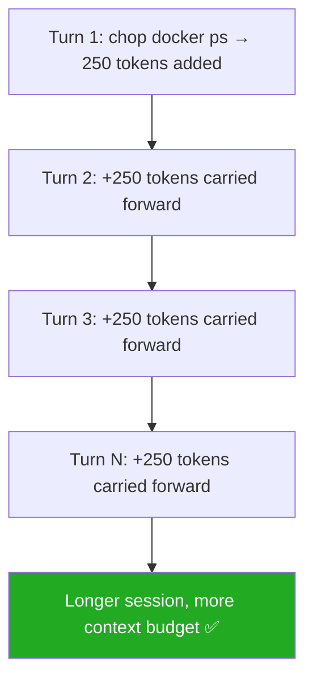

# chop

<p align="center">
  
</p>

**CLI output compressor for Claude Code.**

Claude Code wastes 50-90% of its context window on verbose CLI output —
build logs, test results, container listings, git diffs. **chop** compresses
that output before Claude sees it, saving tokens and keeping conversations
focused.

The name comes from _chop chop_: the sound of something eating through all that verbosity before it ever reaches the context window.

---

## How It Works

When Claude Code runs a Bash command, the raw output is fed back into the
conversation as a `tool_result` — part of the **input** of the next API call.
`chop` intercepts that result and compresses it before it enters the context.



### The Cascade Effect

The savings aren't one-time. Every `tool_result` that enters the context
**stays there** for the rest of the session — included in the input of every
subsequent API call. A bloated command result compounds across turns.





### Why Output Tokens Also Benefit

API output tokens cost **5× more** than input tokens and are slower to
generate (higher TTFB). A larger, noisier context causes the model to produce
longer, more verbose responses — more recapitulation, more hedging. Keeping
the context lean produces tighter, faster output naturally.

```
Input token price:   $3.00 / MTok  (Sonnet 4.6)
Output token price: $15.00 / MTok  (Sonnet 4.6)
```

> ⚠️ **200K threshold**: Once input exceeds 200K tokens, pricing jumps to
> $6.00 input / $22.50 output — applied to the *entire* request, not just
> the excess. Staying compressed avoids crossing that threshold.

---

## Before & After

```
# Without chop (247 tokens)
$ git status
On branch main
Your branch is up to date with 'origin/main'.

Changes not staged for commit:
  (use "git add <file>..." to update what will be committed)
  (use "git restore <file>..." to discard changes in working directory)
        modified:   src/app.ts
        modified:   src/auth/login.ts
        modified:   config.json

Untracked files:
  (use "git add <file>..." to include in what will be committed)
        src/utils/helpers.ts

no changes added to commit (use "git add" and/or "git commit")

# With chop (12 tokens — 95% savings)
$ chop git status
modified(3): src/app.ts, src/auth/login.ts, config.json
untracked(1): src/utils/helpers.ts
```

```
# Without chop (850+ tokens)
$ docker ps
CONTAINER ID   IMAGE                  COMMAND                  CREATED        STATUS        PORTS                    NAMES
a1b2c3d4e5f6   nginx:1.25-alpine      "/docker-entrypoint.…"   2 hours ago    Up 2 hours    0.0.0.0:80->80/tcp       web
f6e5d4c3b2a1   postgres:16-alpine     "docker-entrypoint.s…"   2 hours ago    Up 2 hours    0.0.0.0:5432->5432/tcp   db
...

# With chop (compact table — 70% savings)
$ chop docker ps
web        nginx:1.25-alpine     Up 2h    :80->80
db         postgres:16-alpine    Up 2h    :5432->5432
```

```
# Without chop (1,200+ tokens)
$npm test

> @acme/ui@1.0.0 test
> jest

 PASS  src/lib/button/button.component.spec.ts
 PASS  src/lib/modal/modal.component.spec.ts
 PASS  src/lib/tooltip/tooltip.component.spec.ts
 PASS  src/lib/avatar/avatar.component.spec.ts
 PASS  src/lib/badge/badge.component.spec.ts
 PASS  src/lib/card/card.component.spec.ts
 PASS  src/lib/alert/alert.component.spec.ts
 PASS  src/lib/spinner/spinner.component.spec.ts
 PASS  src/lib/checkbox/checkbox.component.spec.ts
 PASS  src/lib/toggle/toggle.component.spec.ts
...58 more passing suites...

Test Suites: 59 passed, 59 total
Tests:       2 skipped, 1679 passed, 1681 total
Time:        12.296 s

# With chop (5 tokens — 99% savings)
$chop npm test
all 1681 tests passed
```

## Install

**macOS / Linux:**

```bash
curl -fsSL https://raw.githubusercontent.com/AgusRdz/chop/main/install.sh | sh
```

Specific version or custom directory:

```bash
curl -fsSL https://raw.githubusercontent.com/AgusRdz/chop/main/install.sh | CHOP_VERSION=v1.0.0 sh
curl -fsSL https://raw.githubusercontent.com/AgusRdz/chop/main/install.sh | CHOP_INSTALL_DIR=/usr/local/bin sh
```

The installer places the binary in `~/.local/bin` by default. If it is not in your PATH, it is added automatically to `~/.zshrc` or `~/.bashrc`. Reload your shell after installing:

```bash
source ~/.zshrc  # or ~/.bashrc
```

**Windows (PowerShell):**

```powershell
irm https://raw.githubusercontent.com/AgusRdz/chop/main/install.ps1 | iex
```

Specific version or custom directory:

```powershell
$env:CHOP_VERSION="v1.0.0"; irm https://raw.githubusercontent.com/AgusRdz/chop/main/install.ps1 | iex
$env:CHOP_INSTALL_DIR="C:\tools\chop"; irm https://raw.githubusercontent.com/AgusRdz/chop/main/install.ps1 | iex
```

The installer places the binary in `%LOCALAPPDATA%\Programs\chop` by default and adds it to your user PATH automatically. Restart your terminal after installing.

**With Go:**

```bash
go install github.com/AgusRdz/chop@latest
```

**Build from source (requires Docker):**

```bash
git clone https://github.com/AgusRdz/chop.git
cd chop
make install    # builds + copies to ~/.local/bin/
```

Update to latest:

```bash
chop update
```

After updating, chop automatically re-execs the new binary and runs `--post-update-check` to verify the install location. If chop is installed in the legacy `~/bin` directory, it will suggest running the migration script. You can also run this check manually at any time:

```bash
chop --post-update-check
```

## Quick Start

### Use directly

```bash
chop git status          # compressed git status
chop docker ps           # compact container list
chop npm test            # just failures and summary
chop kubectl get pods    # essential columns only
chop terraform plan      # resource changes, no attribute noise
chop curl https://api.io # JSON compressed to structure + types
chop anything            # auto-detects and compresses any output
```

## Agent Integration

### Claude Code (automatic, zero-config)

Register a PreToolUse hook that automatically wraps every Bash command:

```bash
chop init --global       # install hook
chop init --uninstall    # remove hook
chop init --status       # check if installed
```

After this, every command Claude Code runs gets compressed transparently.
You'll see `chop git status` in the tool calls — that's the hook working.

Add this to your `CLAUDE.md` for best results:

```markdown
## Chop (Token Optimizer)

`chop` is installed globally. It compresses CLI output to reduce token consumption.

When running CLI commands via Bash, prefix with `chop` for read-only commands:
- `chop git status`, `chop git log -10`, `chop git diff`
- `chop docker ps`, `chop npm test`, `chop dotnet build`
- `chop curl <url>` (auto-compresses JSON responses)

Do NOT use chop for: interactive commands, pipes, redirects, or write commands
(git commit, git push, npm init, docker run).
```

## Supported Commands (60+)

| Category | Commands | Savings |
|----------|----------|---------|
| **Git** | `git` status/log/diff/branch/push, `gh` pr/issue/run | 50-90% |
| **JavaScript** | `npm` install/list/test/view, `pnpm`, `yarn`, `bun`, `npx`, `tsc`, `eslint`, `biome` | 70-95% |
| **Angular/Nx** | `ng` build/test/serve, `nx` build/test, `npx nx` | 70-90% |
| **.NET** | `dotnet` build/test | 70-90% |
| **Rust** | `cargo` test/build/check/clippy | 70-90% |
| **Go** | `go` test/build/vet | 75-90% |
| **Python** | `pytest`, `pip`, `uv`, `mypy`, `ruff`, `flake8`, `pylint` | 70-90% |
| **Java** | `mvn`, `gradle`/`gradlew` | 70-85% |
| **Ruby** | `bundle`, `rspec`, `rubocop` | 70-90% |
| **PHP** | `composer` install/update | 70-85% |
| **Containers** | `docker` ps/build/images/logs/inspect/stats/rmi/etc., `docker compose` | 60-85% |
| **Kubernetes** | `kubectl` get/describe/logs/top, `helm` | 60-85% |
| **Infrastructure** | `terraform` plan/apply/init | 70-90% |
| **Build** | `make`, `cmake`, `gcc`/`g++`/`clang` | 60-80% |
| **Cloud** | `aws`, `az`, `gcloud` | 60-85% |
| **HTTP** | `curl`, `http` (HTTPie) | 50-80% |
| **Search** | `grep`, `rg` | 50-70% |
| **System** | `ping`, `ps`, `ss`/`netstat`, `df`/`du` | 50-80% |
| **Files/Logs** | `cat`, `tail`, `less`, `more`, `ls`, `find` | 60-95% |
| **Atlassian** | `acli` jira list/get-issue | 60-80% |

Any command not listed above still gets compressed via auto-detection
(JSON, CSV, tables, log lines).

### Log Pattern Compression

When reading log files with `cat`, `tail`, or any log-producing command, chop groups
structurally similar lines by replacing variable parts (UUIDs, IPs, timestamps, numbers,
`key=value` pairs) with a fingerprint, then shows a representative line with a repeat count:

```bash
# Before (51 lines)
2024-03-11 10:00:00 INFO Processing request id=req0001 duration=31ms status=200
2024-03-11 10:00:01 INFO Processing request id=req0002 duration=32ms status=200
... (48 more identical-structure lines)
2024-03-11 11:00:00 ERROR Connection timeout to 10.0.0.5:3306

# After (2 lines)
2024-03-11 11:00:00 ERROR Connection timeout to 10.0.0.5:3306
2024-03-11 10:00:49 INFO Processing request id=req0049 duration=79ms status=200 (x50)
```

Errors and warnings are always shown in full and floated to the top. Falls back to
exact-match deduplication when no repeating patterns are found.

## Token Tracking

Less tokens wasted on noise, more tokens spent on productive work.
Every command is tracked in a local SQLite database:

```bash
chop gain              # overall stats
chop gain --history    # last 20 commands with per-command savings
chop gain --summary    # per-command breakdown
```

```
$ chop gain
chop - token savings report

  today: 42 commands, 12,847 tokens saved
  week:  187 commands, 52,340 tokens saved
  month: 318 commands, 89,234 tokens saved
  year:  1,203 commands, 456,789 tokens saved
  total: 1,203 commands, 456,789 tokens saved (73.2% avg)
```

### The `!` marker in history

`chop gain --history` marks any command with `!` when it produced 0% savings. This happens in two legitimate cases:

- **Write commands** (`git commit`, `git push`, `git add`, `git tag`, etc.) — these produce near-zero output by design. There is nothing to compress; 0% is expected and correct.
- **Already-minimal output** — a `git log --oneline -5` or a `find` that returned one result is already compact. No filter can improve on it.

If these entries feel noisy, you can remove them and prevent them from being tracked again:

```bash
chop gain --no-track "git push"
chop gain --no-track "git commit"
chop gain --no-track "git add"
chop gain --no-track "git tag"
```

This deletes all existing records for that command and permanently suppresses future tracking. To re-enable tracking later:

```bash
chop gain --resume-track "git push"
```

### Unchopped Report

Identify commands that pass through without compression — potential candidates for new filters:

```bash
chop gain --unchopped            # show commands with no filter coverage
chop gain --unchopped --verbose  # untruncated command names + full detail
chop gain --unchopped --skip X   # mark X as intentionally unfiltered (hides it)
chop gain --unchopped --unskip X # restore X to the candidates list
chop gain --delete X             # permanently delete all tracking records for X
chop gain --no-track X           # delete records for X and never track it again
chop gain --resume-track X       # re-enable tracking for a previously ignored command
```

The report has two sections:
- **no filter registered** — output passes through raw; worth writing a filter if AVG tokens is high
- **filter registered, 0% runs** — filter exists but output was already minimal; no action needed

## Diagnostics

```bash
chop doctor            # check and fix common issues
chop hook-audit        # show last 20 hook rewrite log entries
chop hook-audit --clear
chop config            # show global config file path and contents
chop config init       # create a starter global config.yml
chop local             # show local project config
```

## Migrating from ~/bin

Versions before v0.14.4 (pre v1.0.0) installed the binary to `~/bin`. Run the migration script to move it to the standard location and update your shell config automatically.

**macOS / Linux:**

```bash
curl -fsSL https://raw.githubusercontent.com/AgusRdz/chop/main/migrate.sh | sh
```

Then reload your shell:

```bash
source ~/.zshrc  # or ~/.bashrc
```

Or manually:

```bash
mkdir -p ~/.local/bin
mv ~/bin/chop ~/.local/bin/chop
# remove ~/bin from ~/.zshrc or ~/.bashrc, then add:
export PATH="$HOME/.local/bin:$PATH"
```

**Windows (PowerShell):**

```powershell
irm https://raw.githubusercontent.com/AgusRdz/chop/main/migrate.ps1 | iex
```

Or manually:

```powershell
New-Item -ItemType Directory -Force "$env:LOCALAPPDATA\Programs\chop"
Move-Item "$env:USERPROFILE\bin\chop.exe" "$env:LOCALAPPDATA\Programs\chop\chop.exe"
# then update your PATH in System Properties or via:
[Environment]::SetEnvironmentVariable("PATH", "$env:LOCALAPPDATA\Programs\chop;" + [Environment]::GetEnvironmentVariable("PATH","User"), "User")
```

Restart your terminal after migrating.

## Uninstall & Reset

```bash
chop uninstall                # remove hook, data, config, and binary
chop uninstall --keep-data    # uninstall but preserve tracking history
chop reset                    # clear tracking data and audit log, keep installation
```

## Configuration

### Global config

```bash
chop config            # show current global config
chop config init       # create ~/.config/chop/config.yml with examples
```

`~/.config/chop/config.yml`:

```yaml
# Skip filtering - return full uncompressed output
disabled:
  - curl                # disables all curl commands
  - "git diff"          # disables only git diff (git status still compressed)
  - "git show"          # disables only git show
```

Entries can be a base command (disables all subcommands) or `"command subcommand"` for granular control.

### Local config (per-project)

Manage per-project overrides with `chop local`:

```bash
chop local                      # show current local config
chop local add "git diff"       # disable git diff in this project
chop local add "docker ps"      # add another entry
chop local remove "git diff"    # re-enable git diff
chop local clear                # remove local config entirely
```

The first `chop local add` creates a `.chop.yml` file and adds it to `.gitignore` automatically.

When a local `.chop.yml` exists, its `disabled` list **replaces** the global one entirely. This lets you narrow down or expand what's disabled per project.

You can also create `.chop.yml` manually:

```yaml
# .chop.yml — overrides global config for this project
disabled:
  - "git diff"
```

### Custom Filters

Define your own output compression rules for **any** command - no Go code required.

#### Managing filters

```bash
# Global filters (~/.config/chop/filters.yml)
chop filter init                         # create starter global filters file
chop filter add <cmd> [flags]            # add or update a filter
chop filter remove <cmd>                 # remove a filter
chop filter                              # list all active filters
chop filter path                         # show config file location

# Project filters (.chop-filters.yml in current directory)
chop filter init --local                 # create starter local filters file
chop filter add <cmd> [flags] --local    # add or update a project-level filter
chop filter remove <cmd> --local         # remove a project-level filter
```

Local filters are merged on top of global ones - **local always wins on conflict**.

#### Adding filters from the CLI

Use `chop filter add` with one or more rule flags:

```bash
chop filter add "myctl deploy" --keep "ERROR,WARN,deployed,^=" --drop "DEBUG,^\s*$"
chop filter add "ansible-playbook" --keep "^PLAY,^TASK,fatal,changed,^\s+ok=" --tail 20
chop filter add "custom-tool" --exec "~/.config/chop/scripts/custom-tool.sh"
chop filter add "make build" --keep "error:,warning:,^make\[" --tail 10 --local
```

Available flags:

| Flag | Description |
|------|-------------|
| `--keep "p1,p2"` | Comma-separated regex patterns - only keep matching lines |
| `--drop "p1,p2"` | Comma-separated regex patterns - remove matching lines |
| `--head N` | Keep first N lines (after drop/keep) |
| `--tail N` | Keep last N lines (after drop/keep) |
| `--exec script` | Pipe output through an external script or command |
| `--local` | Write to `.chop-filters.yml` in the current directory |

> **Important - no manual escaping needed:** pass regex patterns as-is. chop handles
> escaping when writing the YAML file. Use `\s` for whitespace, `\d` for digits, etc.
>
> ```bash
> # Correct
> chop filter add "mytool" --drop "^\s*$"
>
> # Wrong - double-escaping produces the wrong regex
> chop filter add "mytool" --drop "^\\s*$"
> ```

#### Rules

Rules are applied in this order:

| Rule | Description |
|------|-------------|
| `drop` | Remove lines matching **any** pattern (applied first) |
| `keep` | Keep only lines matching **at least one** pattern |
| `head: N` | Keep first N lines (after drop/keep) |
| `tail: N` | Keep last N lines (after drop/keep) |
| `exec` | Pipe raw output through an external script (stdin - stdout) |

If both `head` and `tail` are set and the output exceeds `head + tail` lines, a `... (N lines hidden)` separator is shown between them.

`exec` takes priority - when set, all other rules are ignored and the script receives the raw output on stdin. Supports any command available in your shell (e.g. `jq .`, `python3 filter.py`).

#### Editing the file manually

You can also edit the YAML files directly. Note that backslashes **must** be escaped in YAML double-quoted strings (`\\s` in the file = `\s` in the regex). This escaping is handled automatically when using `chop filter add`.

```yaml
filters:
  # Keep only error/warning lines from a custom CLI tool
  "myctl deploy":
    keep: ["ERROR", "WARN", "deployed", "^="]
    drop: ["DEBUG", "^\\s*$"]      # \\s in YAML = \s in the regex

  # Show first and last lines of ansible output
  "ansible-playbook":
    keep: ["^PLAY", "^TASK", "fatal", "changed", "^\\s+ok="]
    tail: 20

  # Pipe output through any shell command
  "custom-tool":
    exec: "jq ."
```

#### Testing filters

Test a filter against sample input without running the actual command:

```bash
# Linux/macOS
echo -e "DEBUG init\nINFO started\nERROR failed" | chop filter test myctl deploy

# Windows (PowerShell)
"DEBUG init`nINFO started`nERROR failed" | chop filter test myctl deploy
```


## Development

```bash
make test              # run tests
make coverage          # run tests and show coverage
make build             # build (linux, in container)
make install           # build for your platform + install to ~/bin/
make cross             # build all platforms (linux/darwin/windows × amd64/arm64)
make release-patch     # tag + push next patch version
make release-minor     # tag + push next minor version
```

## License

MIT
