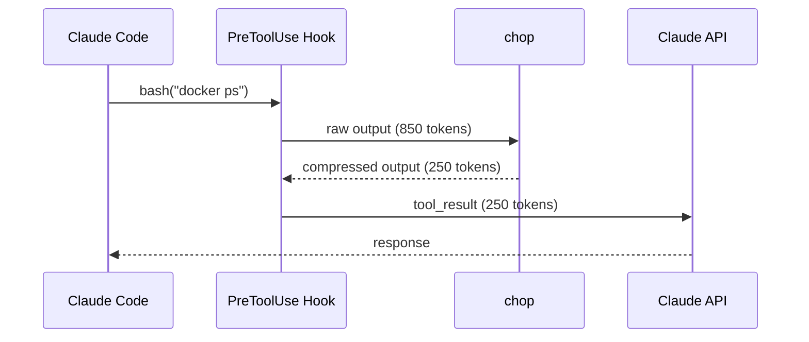
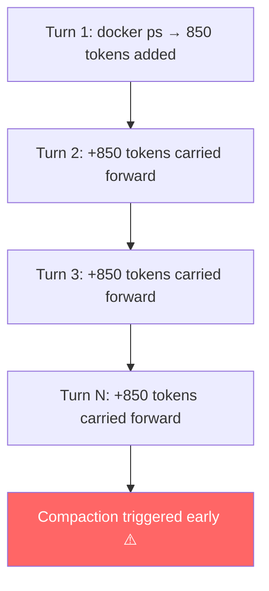
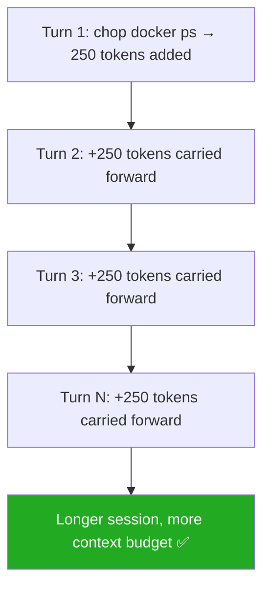

# chop

<p align="center">
  
</p>

**CLI output compressor for Claude Code, Gemini CLI, Codex CLI, and Antigravity IDE.**

Claude Code and other AI agents waste 50-90% of their context window on verbose CLI output —
build logs, test results, container listings, git diffs. **chop** compresses
that output before Claude sees it, saving tokens and keeping conversations
focused.

The name comes from _chop chop_: the sound of something eating through all that verbosity before it ever reaches the context window.

---

## How It Works

When Claude Code runs a Bash command, the raw output is fed back into the
conversation as a `tool_result` — part of the **input** of the next API call.
`chop` intercepts that result and compresses it before it enters the context.



### The Cascade Effect

The savings aren't one-time. Every `tool_result` that enters the context
**stays there** for the rest of the session — included in the input of every
subsequent API call. A bloated command result compounds across turns.





### Why Output Tokens Also Benefit

API output tokens cost **5× more** than input tokens and are slower to
generate (higher TTFB). A larger, noisier context causes the model to produce
longer, more verbose responses — more recapitulation, more hedging. Keeping
the context lean produces tighter, faster output naturally.

```
Input token price:   $3.00 / MTok  (Sonnet 4.6)
Output token price: $15.00 / MTok  (Sonnet 4.6)
```

> ⚠️ **200K threshold**: Once input exceeds 200K tokens, pricing jumps to
> $6.00 input / $22.50 output — applied to the *entire* request, not just
> the excess. Staying compressed avoids crossing that threshold.

---

## Before & After

```
# Without chop (247 tokens)
$ git status
On branch main
Your branch is up to date with 'origin/main'.

Changes not staged for commit:
  (use "git add <file>..." to update what will be committed)
  (use "git restore <file>..." to discard changes in working directory)
        modified:   src/app.ts
        modified:   src/auth/login.ts
        modified:   config.json

Untracked files:
  (use "git add <file>..." to include in what will be committed)
        src/utils/helpers.ts

no changes added to commit (use "git add" and/or "git commit")

# With chop (12 tokens — 95% savings)
$ chop git status
modified(3): src/app.ts, src/auth/login.ts, config.json
untracked(1): src/utils/helpers.ts
```

```
# Without chop (850+ tokens)
$ docker ps
CONTAINER ID   IMAGE                  COMMAND                  CREATED        STATUS        PORTS                    NAMES
a1b2c3d4e5f6   nginx:1.25-alpine      "/docker-entrypoint.…"   2 hours ago    Up 2 hours    0.0.0.0:80->80/tcp       web
f6e5d4c3b2a1   postgres:16-alpine     "docker-entrypoint.s…"   2 hours ago    Up 2 hours    0.0.0.0:5432->5432/tcp   db
...

# With chop (compact table — 70% savings)
$ chop docker ps
web        nginx:1.25-alpine     Up 2h    :80->80
db         postgres:16-alpine    Up 2h    :5432->5432
```

```
# Without chop (1,200+ tokens)
$npm test

> @acme/ui@1.0.0 test
> jest

 PASS  src/lib/button/button.component.spec.ts
 PASS  src/lib/modal/modal.component.spec.ts
...58 more passing suites...

Test Suites: 59 passed, 59 total
Tests:       2 skipped, 1679 passed, 1681 total
Time:        12.296 s

# With chop (5 tokens — 99% savings)
$chop npm test
all 1681 tests passed
```

---

## Install

**macOS / Linux:**

```bash
curl -fsSL https://raw.githubusercontent.com/AgusRdz/chop/main/install.sh | sh
```

Specific version or custom directory:

```bash
curl -fsSL https://raw.githubusercontent.com/AgusRdz/chop/main/install.sh | CHOP_VERSION=v1.0.0 sh
curl -fsSL https://raw.githubusercontent.com/AgusRdz/chop/main/install.sh | CHOP_INSTALL_DIR=/usr/local/bin sh
```

The installer places the binary in `~/.local/bin` by default. If it is not in your PATH, it is added automatically to `~/.zshrc` or `~/.bashrc`. Reload your shell after installing:

```bash
source ~/.zshrc  # or ~/.bashrc
```

**Windows (PowerShell):**

```powershell
irm https://raw.githubusercontent.com/AgusRdz/chop/main/install.ps1 | iex
```

The installer places the binary in `%LOCALAPPDATA%\Programs\chop` by default and adds it to your user PATH automatically. Restart your terminal after installing.

**With Homebrew (macOS / Linux):**

```bash
brew install AgusRdz/tap/chop
```

**With Go:**

```bash
go install github.com/AgusRdz/chop@latest
```

Update to latest:

```bash
chop update
```

## Verification

All release binaries are signed with [GitHub Artifact Attestations](https://docs.github.com/en/actions/security-guides/using-artifact-attestations-to-establish-provenance-for-builds),
providing cryptographic proof that a given binary was built from this repository at a specific commit.

Requires the [GitHub CLI](https://cli.github.com/).

```bash
gh attestation verify chop-darwin-arm64 --repo AgusRdz/chop
```

> **macOS note:** If downloaded manually (not via Homebrew), macOS may block the binary on first run.
> Remove the quarantine flag before running:
> ```bash
> xattr -d com.apple.quarantine ./chop
> ```
> Installing via Homebrew avoids this entirely.

---

## Quick Start

```bash
chop git status          # compressed git status
chop docker ps           # compact container list
chop npm test            # just failures and summary
chop kubectl get pods    # essential columns only
chop terraform plan      # resource changes, no attribute noise
chop curl https://api.io # JSON compressed to structure + types
chop anything            # auto-detects and compresses any output
```

---

## Agent Integration

### Claude Code

Register a `PreToolUse` hook that automatically wraps every Bash command:

```bash
chop init --global       # install hook
chop init --uninstall    # remove hook
chop init --status       # check if installed
```

After this, every command Claude Code runs gets compressed transparently.
You'll see `chop git status` in the tool calls — that's the hook working.

### Gemini CLI

```bash
chop init --gemini             # install hook
chop init --gemini --uninstall # remove hook
chop init --gemini --status    # check if installed
```

### Codex CLI

```bash
chop init --codex              # install hook
chop init --codex --uninstall  # remove hook
chop init --codex --status     # check if installed
```

### Antigravity IDE

```bash
chop init --antigravity              # install hook
chop init --antigravity --uninstall  # remove hook
chop init --antigravity --status     # check if installed
```

### AI Agent Discovery

chop writes a discovery file at `~/.chop/path.json` on every install, update, or hook registration, so AI agents can always locate the binary without searching:

```json
{
  "version": "v1.15.0",
  "path": "/home/user/.local/bin/chop"
}
```

Two commands support agent-first workflows:

```bash
chop agent-info               # output JSON metadata (path, version, installed hooks)
chop init --agent-handshake   # print a high-signal discovery message agents recognize
```

`setup` is also available as an alias for `init`, useful when working with Gemini CLI where `/init` conflicts with a built-in command:

```bash
chop setup --global           # same as chop init --global
```

---

## Supported Commands (60+)

| Category | Commands | Savings |
|----------|----------|---------|
| **Git** | `git` status/log/diff/branch/push, `gh` pr/issue/run | 50-90% |
| **JavaScript** | `npm` install/list/test/view, `pnpm`, `yarn`, `bun`, `npx`, `tsc`, `eslint`, `biome` | 70-95% |
| **Angular/Nx** | `ng` build/test/serve, `nx` build/test, `npx nx` | 70-90% |
| **.NET** | `dotnet` build/test | 70-90% |
| **Rust** | `cargo` test/build/check/clippy | 70-90% |
| **Go** | `go` test/build/vet | 75-90% |
| **Python** | `pytest`, `pip`, `uv`, `mypy`, `ruff`, `flake8`, `pylint` | 70-90% |
| **Java** | `mvn`, `gradle`/`gradlew` | 70-85% |
| **Ruby** | `bundle`, `rspec`, `rubocop` | 70-90% |
| **PHP** | `composer` install/update | 70-85% |
| **Containers** | `docker` ps/build/images/logs/inspect/stats/rmi/etc., `docker compose` | 60-85% |
| **Kubernetes** | `kubectl` get/describe/logs/top, `helm` | 60-85% |
| **Infrastructure** | `terraform` plan/apply/init | 70-90% |
| **Build** | `make`, `cmake`, `gcc`/`g++`/`clang` | 60-80% |
| **Cloud** | `aws`, `az`, `gcloud` | 60-85% |
| **HTTP** | `curl`, `http` (HTTPie) | 50-80% |
| **Search** | `grep`, `rg` | 50-70% |
| **System** | `ping`, `ps`, `ss`/`netstat`, `df`/`du`, `systemctl` | 50-80% |
| **Files/Logs** | `cat`, `tail`, `less`, `more`, `ls`, `find` | 60-95% |
| **Atlassian** | `acli` jira list/get-issue | 60-80% |

Any command not listed above still gets compressed via auto-detection (JSON, CSV, tables, log lines).

### Log Pattern Compression

When reading log files with `cat`, `tail`, or any log-producing command, chop groups
structurally similar lines by replacing variable parts (UUIDs, IPs, timestamps, numbers,
`key=value` pairs) with a fingerprint, then shows a representative line with a repeat count:

```bash
# Before (51 lines)
2024-03-11 10:00:00 INFO Processing request id=req0001 duration=31ms status=200
2024-03-11 10:00:01 INFO Processing request id=req0002 duration=32ms status=200
... (48 more identical-structure lines)
2024-03-11 11:00:00 ERROR Connection timeout to 10.0.0.5:3306

# After (2 lines)
2024-03-11 11:00:00 ERROR Connection timeout to 10.0.0.5:3306
2024-03-11 10:00:49 INFO Processing request id=req0049 duration=79ms status=200 (x50)
```

Errors and warnings are always shown in full and floated to the top.

---

## Configuration

### Global config

`~/.config/chop/config.yml` — configure editor preference and disable built-in filters globally:

```bash
chop config                        # show current config
chop config init                   # create a starter config.yml
chop config set editor <vim|code|nano|...>  # set preferred editor
chop config edit                   # open config.yml in your editor
chop config export                 # export config + filters to stdout (for syncing)
chop config import <file>          # import a previously exported config
```

```yaml
# ~/.config/chop/config.yml

# Preferred editor for all "chop * edit" commands.
# Falls back to $VISUAL, $EDITOR, then auto-detects (code, vim, nano, notepad).
# Set without opening a file: chop config set editor vim
editor: vim

# Disable built-in filters for specific commands.
# Matching is prefix-based: "git diff" disables all git diff variants.
# Both formats are supported:
disabled:
  - git diff            # disables git diff, git diff HEAD, git diff --cached, etc.
  - curl                # disables all curl commands
```

> **Why disable `git diff`?** chop compresses diff output by default, which is useful for AI agents but breaks interactive use. Adding `git diff` to disabled ensures you always see the full diff when running it yourself.

### Local config (per-project)

Override the global disabled list for the current project:

```bash
chop local                      # show current local config
chop local add "git diff"       # disable git diff in this project
chop local remove "git diff"    # re-enable git diff
chop local clear                # remove local config entirely
chop local edit                 # open .chop.yml in your editor
```

The first `chop local add` creates `.chop.yml` and adds it to `.gitignore` automatically.

### Custom Filters

Define your own compression rules for any command — keep/drop regex, head/tail truncation, or pipe through an external script.

```bash
chop filter new "myctl deploy"                          # scaffold + guided workflow (recommended)
chop filter add "myctl deploy" --keep "ERROR,WARN" --drop "DEBUG"  # add directly
chop filter test "myctl deploy"                         # test against stdin
```

→ Full reference: [docs/custom-filters.md](docs/custom-filters.md)

---

## Token Tracking

Every command is tracked locally. See how many tokens you're saving:

```bash
chop gain                  # overall savings summary
chop gain --history        # last 20 commands with per-command savings
chop gain --summary        # per-command breakdown
chop gain --projects       # per-project breakdown
chop gain --unchopped      # commands with no filter — new candidates
chop gain --export json    # export history as JSON or CSV
```

→ Full reference: [docs/token-tracking.md](docs/token-tracking.md)

---

## Shell Completions

Enable tab-completion for all chop commands and flags:

```bash
source <(chop completion bash)        # bash — add to ~/.bashrc
source <(chop completion zsh)         # zsh  — add to ~/.zshrc
chop completion fish | source         # fish
chop completion powershell | Invoke-Expression  # PowerShell
```

→ Setup instructions: [docs/shell-completions.md](docs/shell-completions.md)

---

## Maintenance

```bash
chop doctor            # check and auto-fix common issues
chop update            # update to the latest version
chop auto-update on    # enable background auto-updates
chop enable / disable  # resume or bypass chop globally
chop uninstall         # remove everything
chop reset             # clear tracking data, keep installation
```

→ Full reference: [docs/maintenance.md](docs/maintenance.md)

---

## Development

```bash
make test              # run tests
make coverage          # run tests and show coverage
make build             # build (linux, in container)
make install           # build for your platform + install to ~/bin/
make cross             # build all platforms (linux/darwin/windows × amd64/arm64)
make release-patch     # tag + push next patch version
make release-minor     # tag + push next minor version
```

## Contributors

chop started as a Claude Code-focused tool and has grown through community contributions.

- **[@giankpetrov](https://github.com/giankpetrov)** — Codex CLI integration, Antigravity IDE integration, systemctl filter, Windows native path support, security hardening, and AI agent discovery
- **[@aeanez](https://github.com/aeanez)** — log compaction, unchopped report, custom filters, changelog command, enable/disable toggle, auto-update toggle, and Gemini CLI integration

## License

MIT
